# windows+Intellij idea+hadoop2.7.3 下伪分布式开发环境搭建   

环境介绍  
windows10 + hadoop2.7.3 + Intellij IDEA2017.1.4  

hadoop下载：http://apache.opencas.org/hadoop/common/  
解压至无空格目录下即可  


# 下面配置windows环境：  

## Java JDK ：    

我采用的是网上的绿色版 配置JAVA_HOME 为 E:\java\jdk1.8.0_40   
目录路径中不要存在空格，否者hadoop启动报错。    

## Hadoop 环境变量：   
新建HADOOP_HOME，指向hadoop解压目录，如：E:\java\hadoop-2.7.3   
path环境变量中增加：%HADOOP_HOME%\bin;  

## Hadoop 依赖库：
winutils相关，hadoop在windows上运行需要winutils支持和hadoop.dll等文件，上github搜索相应hadoop版本的winutils  
下载地址：https://github.com/rucyang/hadoop.dll-and-winutils.exe-for-hadoop2.7.3-on-windows_X64  
注意：hadoop.dll等文件不要与hadoop冲突。   
为了不出现依赖性错误可以将hadoop.dll放到c:/windows/System32下一份。(这步骤不要省略，没放过去会报错的。)  

## hadoop环境测试：  
起一个cmd窗口，起到E:\java\hadoop-2.7.3\bin下，  
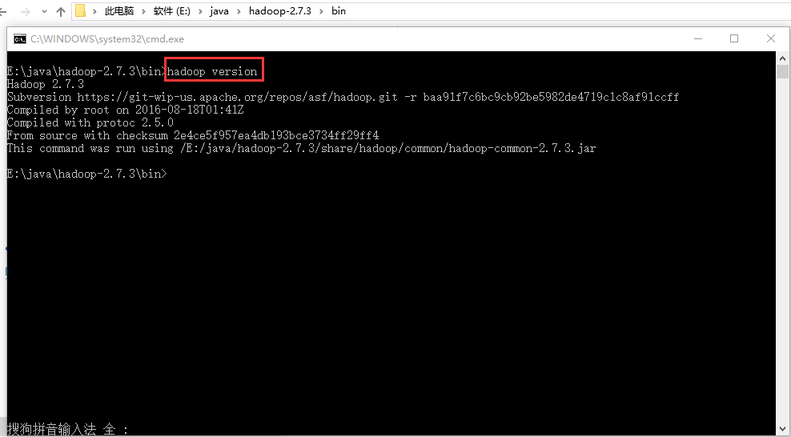
格式化系统文件：E:\java\hadoop-2.7.3\bin下执行   
````
hdfs namenode -format  
````
# Intellij idea 搭建开发环境   
## 1. 打开Idea新建一个Java项目   
### 1.1新建项目  
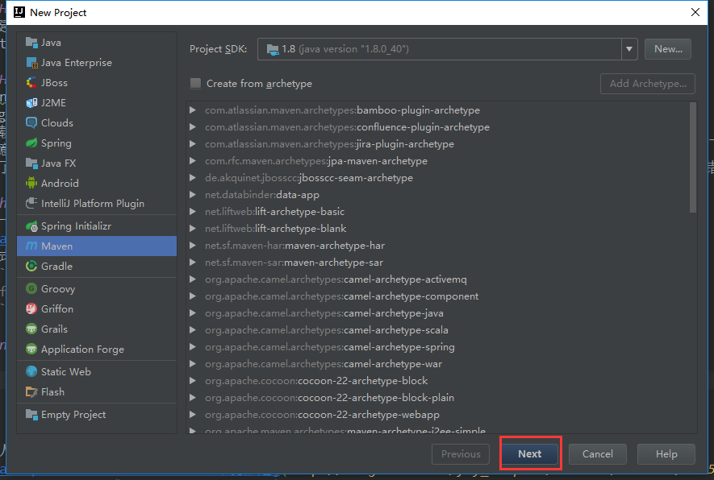  
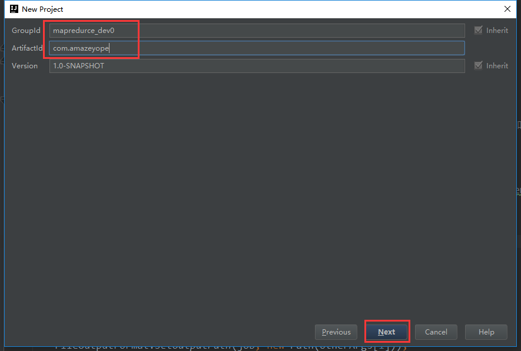  
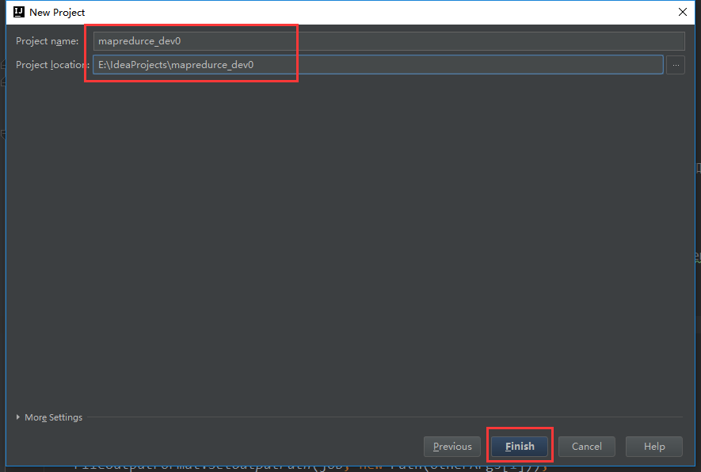  
## 2. 项目配置 File ---- Project Structure    
### 2.1sdk的配置  
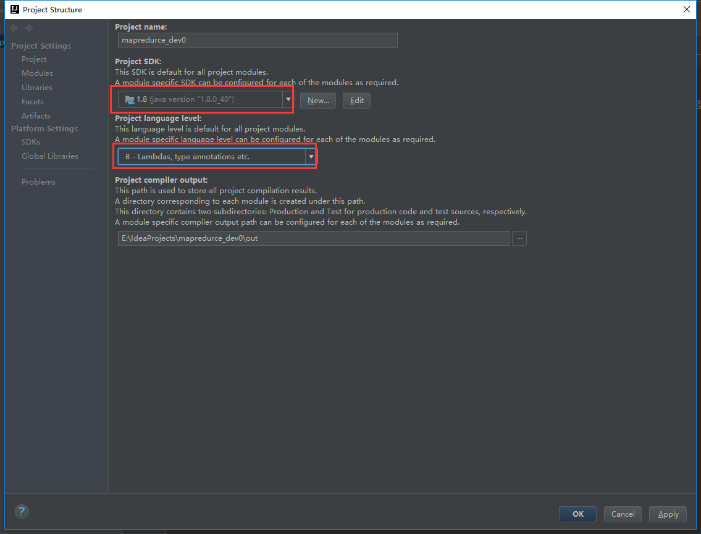  
### 2.2项目的pom.xml中添加如下的依赖    
````
<dependencies>
        <dependency>
            <groupId>junit</groupId>
            <artifactId>junit</artifactId>
            <version>4.12</version>
            <scope>test</scope>
        </dependency>
        <dependency>
            <groupId>org.apache.hadoop</groupId>
            <artifactId>hadoop-common</artifactId>
            <version>2.7.3</version>
        </dependency>
        <dependency>
            <groupId>org.apache.hadoop</groupId>
            <artifactId>hadoop-hdfs</artifactId>
            <version>2.7.3</version>
        </dependency>
        <dependency>
            <groupId>org.apache.hadoop</groupId>
            <artifactId>hadoop-mapreduce-client-core</artifactId>
            <version>2.7.3</version>
        </dependency>
        <dependency>
            <groupId>org.apache.hadoop</groupId>
            <artifactId>hadoop-mapreduce-client-jobclient</artifactId>
            <version>2.7.3</version>
        </dependency>
        <dependency>
            <groupId>log4j</groupId>
            <artifactId>log4j</artifactId>
            <version>1.2.17</version>
        </dependency>
    </dependencies>
````
然后reimport 加载jar包   
 
### 2.3打包配置    
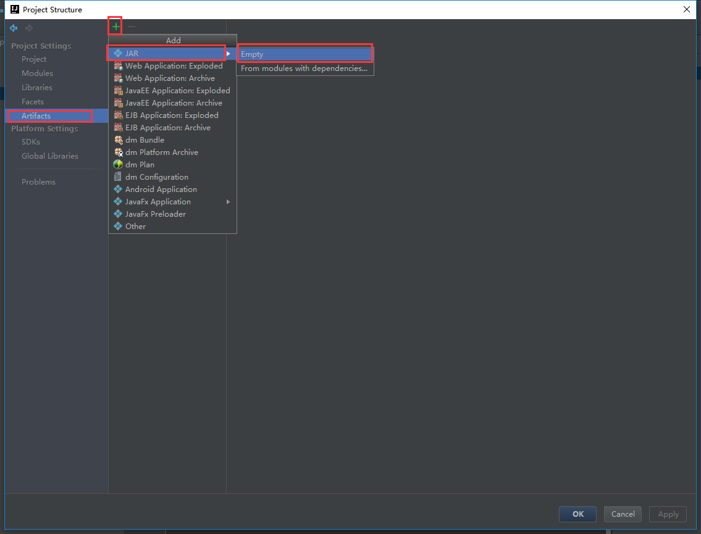  
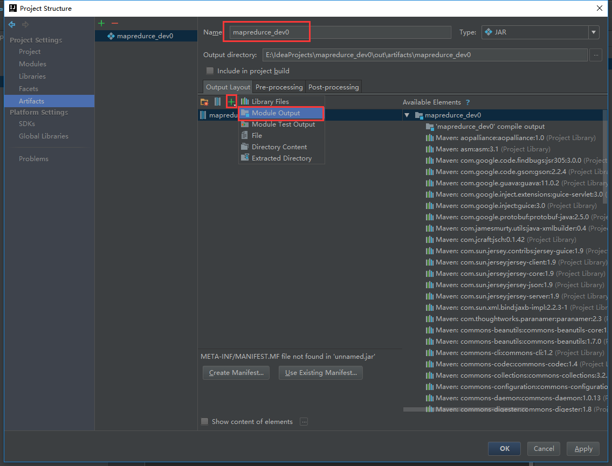  
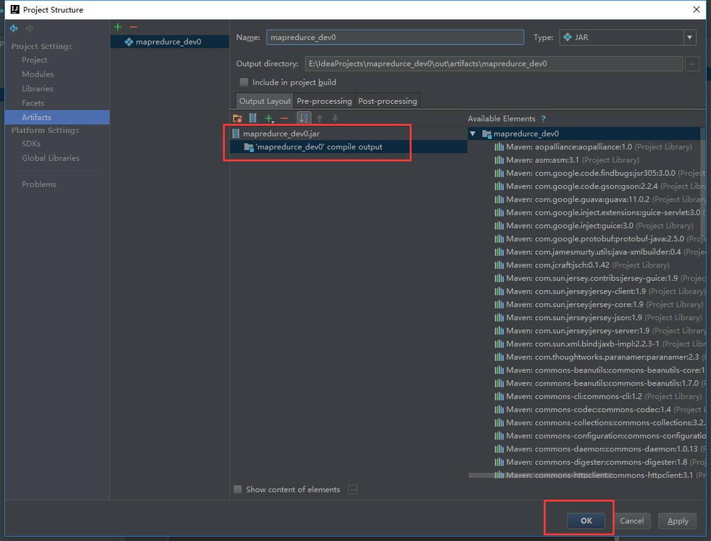  

## 3.开发map-reduce代码 （详见本项目代码部分）  
````
FileUtil.java
WordCount.java
log4j.properties
````
## 4.配置编译器（edit configurations）    
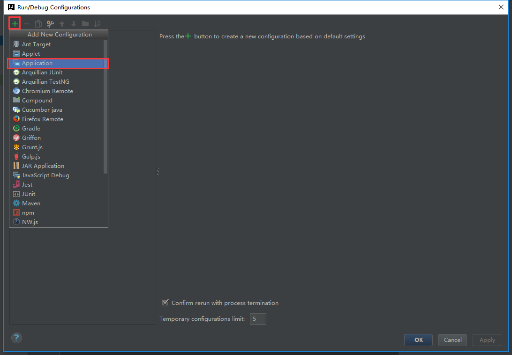  
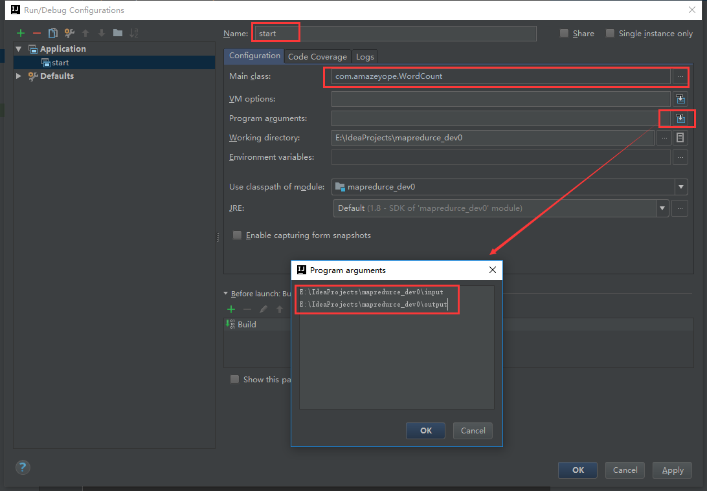  
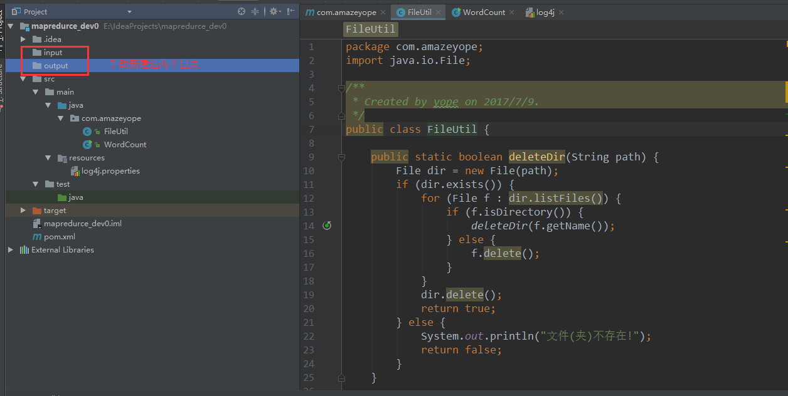  
在input 目录下新建 dream.txt 输入如下单词，也可随意。    
````
hello world 
hello mapredurce
````

## 5.点击运行，查看运行结果。成功的话在output文件夹下可以看到统计数据。    
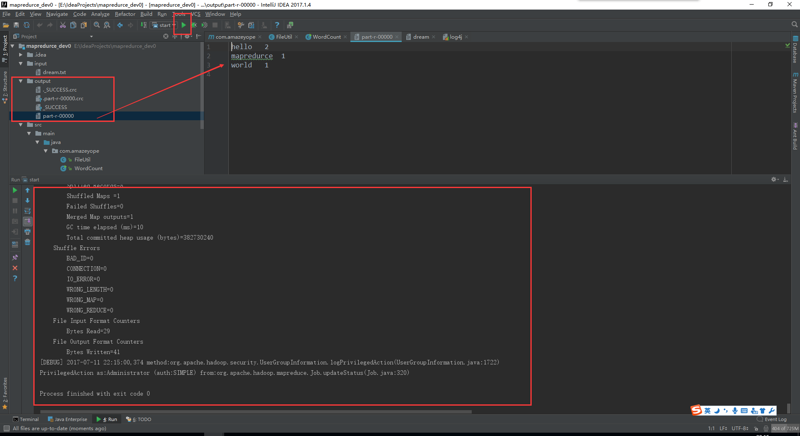 
 
 
本人参考链接：    
[hadoop2.7.2 window win7 基础环境搭建](http://blog.csdn.net/fly_leopard/article/details/51250443)  
[Intellij idea开发Hadoop MapReduce程序](http://blog.csdn.net/fenghuibian/article/details/52918576)  


​           
​           

